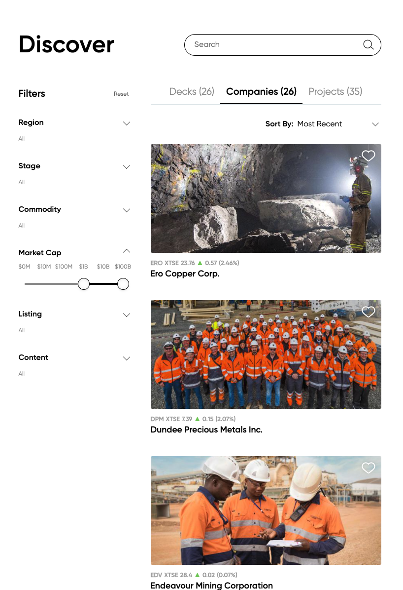
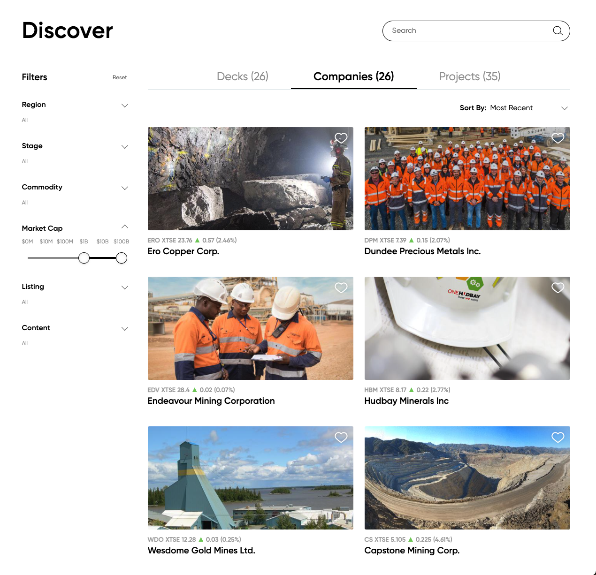
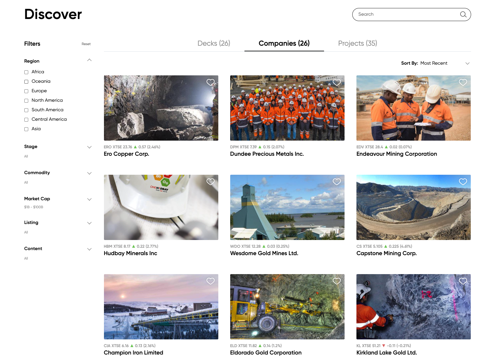

# Vrify Web Coding Assignment

This app is deployed here: [https://vrify-vkronberg.vercel.app/](https://vrify-vkronberg.vercel.app/).

## Requirements

There is a data.json included that has a list of companies that we'd like to
display on a page. The page will include two filters and pagination. The
assignment shouldn't take more than 3-4 hours.

- Use any modern reactive webapp framework (ex/ React, Vue, Angular, etc.)

### Results

- Should show company image
  - Images should all have the same dimensions
  - In the data provided, the images are of different dimensions. The images
    should all have the same dimensions and the images should be **cropped** to
    fit the column (**not stretched**)
- Should have company name underneath image

### Filters

- One filter for regions: Africa, Oceania, Europe, North America, South
  America, Central America, Asia

  - Multiple filters are allowed to be selected and each one is an **OR**
    filter. Example:
    - "Africa" selected - only companies that are in "Africa"
    - "Africa, Oceania" selected - both companies that are in "Africa" and
      "Oceania"

- Range filter for Market Cap: Data is in "millions". Range options should be $0M,
  $20M, $40M, $60M, $80M, $100M, $100M+ and it'd be a slider for min and max
  values. Example:
  - Min: "$0M", Max: "$100M+" - All companies
  - Min: "$60M", Max: "80M" - Companies with a market cap between 60 and 80
    (range values inclusive)

### Pagination

- Each page should have 8 results and additional pages should be on the bottom
  of the page

### Responsive

- Should go from one column of results to three columns based off of screen
  size.

- Filters can be placed anywhere on mobile view

### Tests

- Tests should be included - include any tests you find necessary

### Examples

**Note: the assignment doesn't have to match these screenshots, they're just
examples so you can get an idea of what the end result "could" look like**

One column:

Two column:

Three column:

## Solution

The submitted solution is using create-react-app, responsive styles for main components are done with MaterialUi library.
Coded in 4 hours (without implementing tests)

## Installation and running this solution

This project was bootstrapped with [Create React App](https://github.com/facebook/create-react-app).

### Available Scripts

In the project directory, you can run:

#### `npm start`

Runs the app in the development mode.\
Open [http://localhost:3000](http://localhost:3000) to view it in your browser.

The page will reload when you make changes.\
You may also see any lint errors in the console.

#### `npm test`

Launches the test runner in the interactive watch mode.\
See the section about [running tests](https://facebook.github.io/create-react-app/docs/running-tests) for more information.

#### `npm run build`

Builds the app for production to the `build` folder.\
It correctly bundles React in production mode and optimizes the build for the best performance.

The build is minified and the filenames include the hashes.\
Your app is ready to be deployed!

See the section about [deployment](https://facebook.github.io/create-react-app/docs/deployment) for more information.

#### `npm run eject`

**Note: this is a one-way operation. Once you `eject`, you can't go back!**

If you aren't satisfied with the build tool and configuration choices, you can `eject` at any time. This command will remove the single build dependency from your project.

Instead, it will copy all the configuration files and the transitive dependencies (webpack, Babel, ESLint, etc) right into your project so you have full control over them. All of the commands except `eject` will still work, but they will point to the copied scripts so you can tweak them. At this point you're on your own.

You don't have to ever use `eject`. The curated feature set is suitable for small and middle deployments, and you shouldn't feel obligated to use this feature. However we understand that this tool wouldn't be useful if you couldn't customize it when you are ready for it.

### Learn More

You can learn more in the [Create React App documentation](https://facebook.github.io/create-react-app/docs/getting-started).

To learn React, check out the [React documentation](https://reactjs.org/).

#### Code Splitting

This section has moved here: [https://facebook.github.io/create-react-app/docs/code-splitting](https://facebook.github.io/create-react-app/docs/code-splitting)

#### Analyzing the Bundle Size

This section has moved here: [https://facebook.github.io/create-react-app/docs/analyzing-the-bundle-size](https://facebook.github.io/create-react-app/docs/analyzing-the-bundle-size)

#### Making a Progressive Web App

This section has moved here: [https://facebook.github.io/create-react-app/docs/making-a-progressive-web-app](https://facebook.github.io/create-react-app/docs/making-a-progressive-web-app)

#### Advanced Configuration

This section has moved here: [https://facebook.github.io/create-react-app/docs/advanced-configuration](https://facebook.github.io/create-react-app/docs/advanced-configuration)

#### Deployment

This section has moved here: [https://facebook.github.io/create-react-app/docs/deployment](https://facebook.github.io/create-react-app/docs/deployment)

#### `npm run build` fails to minify

This section has moved here: [https://facebook.github.io/create-react-app/docs/troubleshooting#npm-run-build-fails-to-minify](https://facebook.github.io/create-react-app/docs/troubleshooting#npm-run-build-fails-to-minify)
